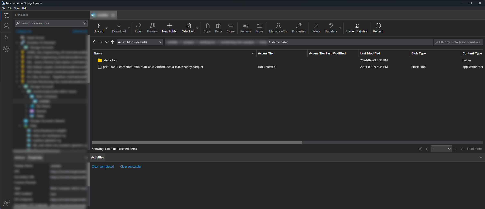
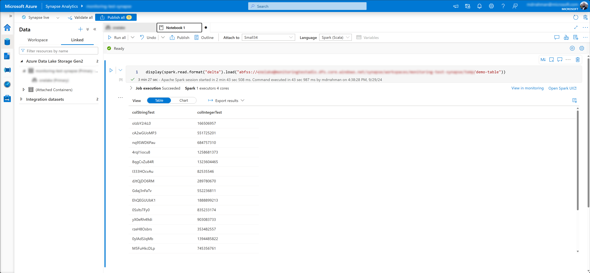

# Quickstart: Local demo project

<!-- TOC depthfrom:2 -->

- [Pre-reqs](#pre-reqs)
    - [For Windows Development](#for-windows-development)
- [Getting started](#getting-started)

<!-- /TOC -->

This is a quickstart project to quickly write to a local filepath and cloud-based filepaths (such as Azure Data Lake Storage).

## Pre-reqs

### For Windows Development

1. [Visual Studio Community Edition](https://visualstudio.microsoft.com/vs/community/) or dotnet cli
2. [Rustup, via Winget](https://winget.run/pkg/Rustlang/Rustup), to build the `delta_rs_bridge.dll` locally

## Getting started

Step 1: Build the project via Visual Studio

Step 2: Pass in command line parameters via one of the launch profiles

```powershell
# Write 20 rows to Azure Data Lake storage
"abfss://container@storageaccount.dfs.core.windows.net/a/b/demo-table" "20"

# Write 20 rows to local filesystem
"E:\.temp\demo-table" "20"
```

Step 3: Run the project via Visual Studio

After the run, if ran locally, you should see:

```powershell
PS E:\.temp\demo-table> ls

    Directory: E:\.temp\demo-table


Mode                 LastWriteTime         Length Name
----                 -------------         ------ ----
d-----        2024-09-29   4:31 PM                _delta_log
-a----        2024-09-29   4:31 PM           1293 part-00001-4e777857-74e3-4b26-8baf-2e6096e6eb09-c000.snappy.parquet
```

And, if ran in Azure:



You can read this C#-written Delta file in engines such as Spark:

